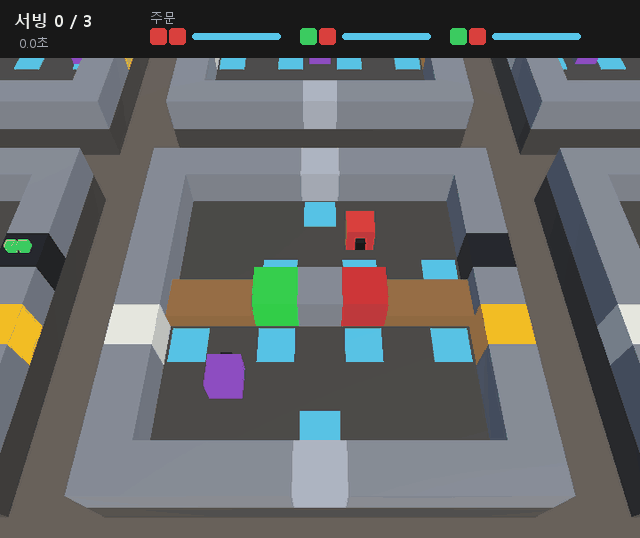
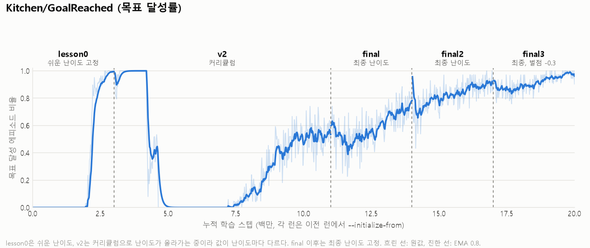
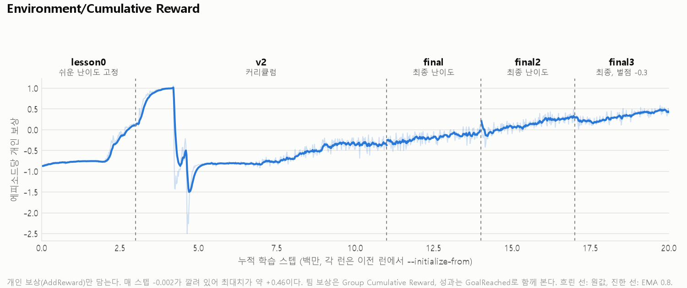
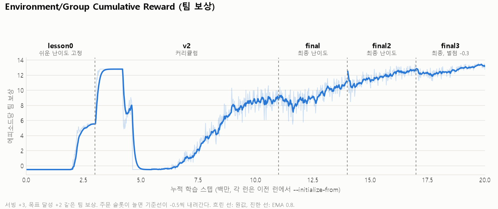
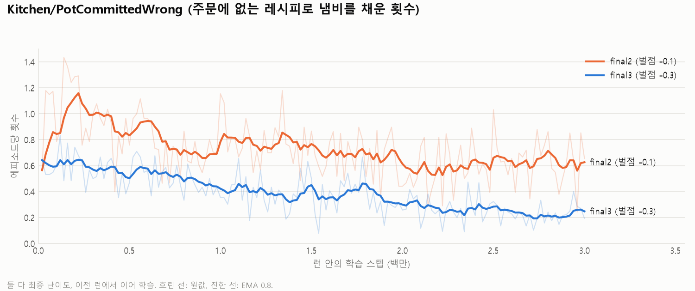

# UnderCooked 최종 보고서 (2026-09-29)

MA-POCA로 2인 협동 요리 정책을 학습한 프로젝트의 최종 정리.
환경 설계의 세부 내용은 `README.md`, 날짜별 분석은 아래 보고서에 있다. 이 문서는 그 결과를 한곳에 모으고
보관한 산출물의 위치를 적는다.

| 문서 | 내용 |
|---|---|
| `README.md` | 게임 규칙, 관측·행동·보상 설계, 설계 과정에서 고친 것(§4), 결과(§6), 회고(§9) |
| `reports/2026-09-25-preflight.md` | 학습 전 환경 점검 (버전 실측) |
| `reports/2026-09-25-undercooked_v1-serve-zero.md` | v1 서빙 0회 원인 분석, lesson0 진단 |
| `reports/2026-09-25-training-results.md` | 런별 경과, 실패 분석(병목 정정), final2·final3 |
| `reports/2026-09-28-submission-checklist.md` | 제출 전 남은 작업 |
| `archive/README.md` | 학습 결과 파일 보관 목록 |



---

## 1. 결과 요약

- **최종 모델 `models/undercooked.onnx` (`undercooked_final3`)는 최종 난이도에서 3접시 목표 달성률 97.8%다.**
  학습 없이 Unity에서 추론만 돌려도 97.1%(에피소드 478개)가 나와 학습 지표와 일치한다.
- 최종 난이도: 손질 켜짐, 레시피 3종, 조리 5초, 주문 슬롯 3, 주문 제한 25초, 목표 3접시, 에피소드 45초.
- 아무것도 하지 않는 정책은 목표 달성 0%, 팀 보상 −1.5다.
- 무작위 초기화부터 기본 커리큘럼 한 번으로는 학습되지 않았다(v1). **lesson0 고정 → 커리큘럼 → 최종 난이도
  고정**의 3단계와, 원인 분석 뒤의 벌점 조정 1회로 도달했다. 총 20M 스텝(v1 제외), 1M 스텝당 약 13분.

| 지표 (최종 난이도) | 학습 (final3 2.5–3M) | Unity 추론 (478 에피소드) |
|---|---|---|
| 목표 달성 | **97.8%** | **97.1%** |
| 서빙 / 에피소드 | 2.97 | 2.96 |
| 냄비 확정 / 에피소드 | 3.26 | 3.25 |
| 주문에 없는 레시피로 채움 | 0.22 (7%) | – |
| 주문과 다른 요리 제출 | 0.26 | – |
| 주문 만료 | 1.10 | – |
| 팀 보상 (`Group Cumulative Reward`) | +13.29 | – |
| 개인 보상 (`Cumulative Reward`) | +0.46 | – |
| 에피소드 길이 (decision) | 281 | – |

Unity 추론 서빙 분포는 1접시 3 / 2접시 11 / 3접시 464로, 0접시 에피소드는 없었다. 성공 에피소드는 평균 27.7초
(25/50/75 분위 24.9 / 25.4 / 27.4초)에 끝난다.

---

## 2. 환경 요약

| 항목 | 내용 |
|---|---|
| 에이전트 | 셰프 2명 1팀 (`SimpleMultiAgentGroup`), 주방 16개 동시 학습 (셰프 32명) |
| 협동 강제 | 냄비는 A 구역, 그릇함·서빙구는 B 구역. 경계는 걸어서 넘을 수 없고 카운터 4칸으로만 주고받는다 |
| 관측 | 103차원, 전부 상대좌표. 주문판 3슬롯(레시피 + 남은 시간) 포함. 조리 완료 여부는 뺐다 |
| 행동 | Discrete 2 branch (이동 5, 상호작용 2) + Action Masking |
| 보상 | 팀: 서빙 +3, 목표 +2, 투입 +0.3·손질 +0.2(무산되면 회수), 주문 만료 −0.5. 개인: 전달 +0.15(서빙으로 안 이어지면 회수), 집기 +0.05, 주문에 없는 재료 투입 −0.3, 주문에 없는 요리 서빙 −0.5, 스텝 −0.002 |
| 고급 개념 | MA-POCA, Action Masking, Memory(LSTM, sequence 64 / memory 128), Curriculum |

상세 표는 README §1~§3.

---

## 3. 학습 경로



| run-id | 설정 | 스텝 / 시간 | 결과 |
|---|---|---|---|
| `undercooked_v1` | 기본 커리큘럼, 무작위 초기화 | 1.44M (중단) | 서빙 0회 |
| `undercooked_lesson0` | lesson0 고정 | 3M / 39분 | 1.96M 첫 서빙, 3M 99.7% |
| `undercooked_v2` | 기본 커리큘럼, `--initialize-from=undercooked_lesson0` | 8M / 1시간 39분 | 최종 난이도 54% |
| `undercooked_final` | 최종 난이도 고정, `--initialize-from=undercooked_v2` | 3M / 39분 | 74% |
| `undercooked_final2` | 같은 설정 + 주문 불일치 지표 | 3M / 40분 | 90.5% |
| `undercooked_final3` | 같은 설정 + 주문에 없는 재료 투입 벌점 −0.1 → −0.3 | 3M / 40분 | **97.8%** |

모든 런은 실행 전 보상 회귀 검사 전 항목 통과와 `학습 모드 (트레이너 연결됨, 주방 16개)` 표시를 확인하고 시작했다.

### 곡선





- `Environment/Cumulative Reward`는 **개인 보상만** 담는다. 스텝 비용이 깔려 있어 최대 약 +0.46이다.
  성과는 팀 보상과 `GoalReached`로 읽는다 (README §4-16).
- v2의 누적 4.2M~4.6M(v2 기준 1.2M~1.6M) 급락은 레시피 2종, 손질 전환이 이어진 구간이다. 손질이 켜지자
  냄비를 한 번도 채우지 못했다(`Kitchen/PotCommitted` 0). 약 1.5M 스텝 뒤 스스로 손질 경로를 찾아 회복했다.
- final 이후 곡선은 최종 난이도 고정이라 서로 직접 비교할 수 있다.

---

## 4. 무엇이 성패를 갈랐나

### 4-1. v1 실패: 커리큘럼이 첫 서빙보다 빨랐다

v1은 1.44M 스텝 동안 서빙 0회였고 팀 보상이 모든 요약에서 정확히 −0.500이었다. progress 커리큘럼이 1.2M에 레시피
2종, 1.6M에 손질을 켰는데, 같은 보상 체계로 lesson0만 고정해 돌려 보니 첫 서빙에 1.96M이 걸렸다. 서빙을 한 번도 본 적 없는
상태에서 난이도가 올라간 것이다. lesson0을 먼저 따로 학습하고 `--initialize-from`으로 이어 가는 방식으로 바꿨다.

### 4-2. 학습률 재시작

v2 마지막 1M 스텝은 48% → 54%로 거의 제자리였다(linear 학습률 감소). 같은 모델로 최종 난이도를 고정하고 학습률을
3e-4부터 다시 시작한 final은 3M 동안 +20%p 올랐다.

### 4-3. 병목 판단 정정: 속도가 아니라 주문 대조

final 시점의 에피소드 평균(냄비 확정 3.49, 서빙 2.63)만 보고 처음에는 "만드는 속도가 병목"이라고 판단했다. Unity 추론
에피소드 322개를 성공/실패로 나눠 보니 달랐다.

| | 에피소드 | 서빙 | 냄비 확정 | B까지 가고 버려진 요리 |
|---|---|---|---|---|
| 성공 | 237 | 3.00 | 3.32 | 0.36 |
| 실패 | 85 | 1.73 | **4.07** | **1.80** |

실패 85개 중 81개가 냄비를 3번 이상 채웠다. 만들 시간은 충분했고 주문과 맞지 않는 요리를 만들고 있었다.
평균 지표는 성공과 실패를 섞어서 이걸 가렸다.

### 4-4. 원인 분리 → 벌점 조정

주문 불일치 지표 2종(`Kitchen/PotCommittedWrong`, `Kitchen/ServedWrongOrder`)을 넣고 final2를 돌렸다. 틀린 제출(0.48)이
잘못 채운 횟수(0.63)보다 적었다. 불일치는 대부분 **처음부터 주문에 없는 레시피로 채우는 것**이었고, 채운 뒤 주문이
만료되는 경우는 적었다. final2는 2M 이후 90% 근처에서 멈췄다.

그래서 이 한 가지만 겨냥해 주문에 없는 재료 투입 벌점을 −0.1 → −0.3으로 올렸다(코드 기본값과 프리팹 셰프 2명 값).
회귀 검사 11개 항목을 다시 통과시킨 뒤 final2에서 3M 이어 학습했다.



| 구간 | 목표 달성 | 냄비 확정 | 잘못 채움 |
|---|---|---|---|
| final2 2.5–3M | 90.5% | 3.47 | 0.63 (18%) |
| final3 0.8–1.0M | 87.7% | 3.29 | 0.44 (13%) |
| final3 1.8–2.0M | 94.9% | 3.25 | 0.28 (9%) |
| final3 2.5–3.0M | **97.8%** | 3.26 | **0.22 (7%)** |

1.5M까지는 오히려 87.7%로 낮았다. 벌점에 적응하며 냄비 확정 자체가 줄었던 기간이다. 2M 이후 냄비를 덜 채우고도
서빙이 늘었다.

### 4-5. 학습 전에 막은 것

README §4에 설계 과정에서 고친 19건이 있다. 결과에 직접 영향을 준 것:

- 카운터에 놓았다 집기 반복, 건네고 나서 버리기 같은 **보상 어뷰징 경로**. 전달 보상은 동료가 집은 순간에만 주고,
  진행·전달 보상은 무산되면 회수하도록 바꿨다. 회귀 검사 항목으로 남겼다 (§4-1, §4-12, §4-19).
- 커리큘럼 임계값(3.0 / 6.0)이 팀 보상을 담지 않는 개인 보상과 비교되어 구조적으로 통과할 수 없었다 (§4-16).
  임계값을 개인 보상 단위로 다시 잡았다.
- Play를 먼저 누르면 주방 15개가 꺼진 채 학습되는 문제 (§4-17). Play 직후 `학습 모드 (트레이너 연결됨, 주방 16개)`를
  찍게 해서 매 런 시작 때 확인했다.

---

## 5. 한계와 하지 않은 것

| 항목 | 상태 |
|---|---|
| 처음부터 재현 | 현재 코드(벌점 −0.3)로 lesson0 → final3 순서를 처음부터 다시 돌려 보지 않았다. final3는 −0.1로 학습한 final2에서 이어 학습했다 |
| Memory 효과 | 설정에는 쓰였지만 이 브랜치 안에서 효과를 검증하지 않았다. on/off 비교는 별도 실험(PR #17, 병합 안 함)에 있다 |
| 커리큘럼 | progress 커리큘럼은 손질 전환에서 무너진다. 한 번에 끝까지 학습하는 커리큘럼은 만들지 못했다 |
| 시드 | 모든 런이 시드 1개다. 성적의 분산은 재지 않았다 |
| 주문 관측 ablation | 하지 않음 |
| 조리 완료를 관측에 넣은 진단 조건 | 하지 않음 |
| 남은 약점 | 주문에 없는 레시피로 채우기 7%. 벌점을 더 올리면 냄비 자체를 꺼리는 경향(4-4의 초반)이 커질 수 있다 |

---

## 6. 재현

### 학습

README §5의 순서를 그대로 따른다. 각 런은 이전 런의 `results/<run-id>/Chef/checkpoint.pt`에서 시작한다.

```bash
mlagents-learn configs/undercooked_lesson0.yaml --run-id=undercooked_lesson0 --torch-device cuda
mlagents-learn configs/undercooked.yaml       --run-id=undercooked_v2     --initialize-from=undercooked_lesson0 --torch-device cuda
mlagents-learn configs/undercooked_final.yaml --run-id=undercooked_final  --initialize-from=undercooked_v2       --torch-device cuda
mlagents-learn configs/undercooked_final.yaml --run-id=undercooked_final2 --initialize-from=undercooked_final    --torch-device cuda
mlagents-learn configs/undercooked_final.yaml --run-id=undercooked_final3 --initialize-from=undercooked_final2   --torch-device cuda
```

실행 전 체크리스트는 `.claude/docs/TRAINING.md` §2. 체크포인트는 보관하지 않았으므로, 중간 런부터 이어 가려면
해당 런까지 다시 학습해야 한다.

### 추론 확인

1. 셰프 32명의 Behavior Parameters > Model에 `models/undercooked.onnx`를 넣는다 (Behavior Type `Default`).
2. `KitchenEnv`의 `defaultTargetDishes`를 3, `defaultOrderDuration`을 25로 바꾼다.
   **트레이너 없는 Play의 기본값(2 / 20초)은 최종 난이도가 아니다.**
3. 트레이너 없이 Play. 주방 16개가 모두 모델로 움직인다.
4. 확인 후 씬을 저장하지 않고 다시 불러온다.

자동화한 절차는 `archive/tools/inference/`와 TRAINING.md에 있다.

### 그래프·GIF 다시 만들기

```bash
python archive/tools/figures/export.py scalars.csv archive/runs   # mlagents 환경 (tensorboard 필요)
python archive/tools/figures/plot.py scalars.csv                  # matplotlib 환경. assets/tb_*.png
```

GIF는 Play 중 `figures/cam.cs` → `rec.cs`로 프레임을 녹화하고 `gif2.py`로 만든다. 녹화한 에피소드는
주방 `TrainingArea_09`의 한 에피소드(24.2초, 3접시)다. 3번째 서빙과 에피소드 리셋이 같은 틱에 일어나서,
마지막 프레임은 직전 화면에 "서빙 3/3"을 표시했다.

---

## 7. 산출물

| 경로 | 내용 |
|---|---|
| `models/undercooked.onnx` | 최종 모델 (`undercooked_final3`) |
| `archive/runs/<run-id>/` | 런 6개의 TensorBoard 이벤트, 설정, 런 종료 모델, 실행 기록, 콘솔 로그 |
| `archive/tools/` | 지표 요약, Unity 추론 확인, 그래프·GIF 생성 스크립트 |
| `assets/tb_*.png` | 학습 곡선 4장 |
| `assets/demo.gif` | 최종 정책 데모 |
| `configs/` | 학습 설정 3종 (ASCII 전용) |
| `UnityProject/` | 환경 (씬 `Assets/Scenes/UnderCooked.unity`) |

## 8. 환경

데스크탑 RTX 2080 SUPER. Unity 6000.3.18f1, URP 17.3.0, `com.unity.ml-agents` 4.0.3 (통신 API 1.5.0).
Python 3.10.12, `mlagents` / `mlagents-envs` 1.2.0.dev0 (소스 설치), torch 2.2.2+cu121, numpy 1.23.5, protobuf 3.20.3.
