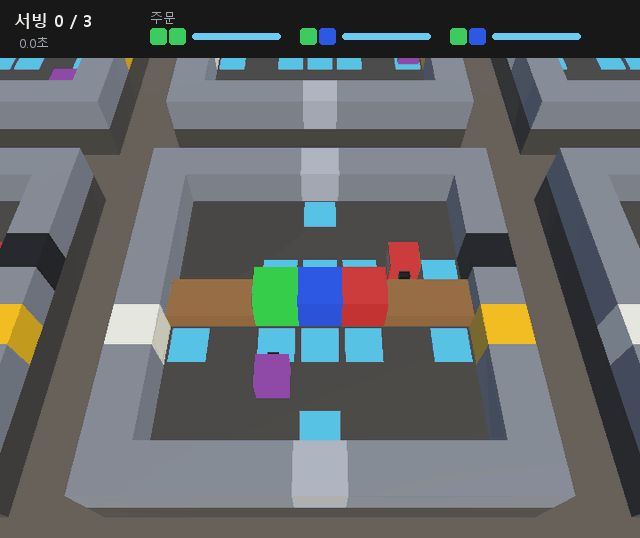
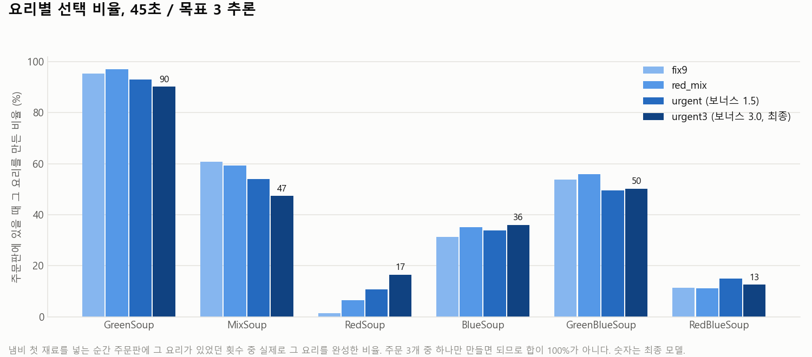
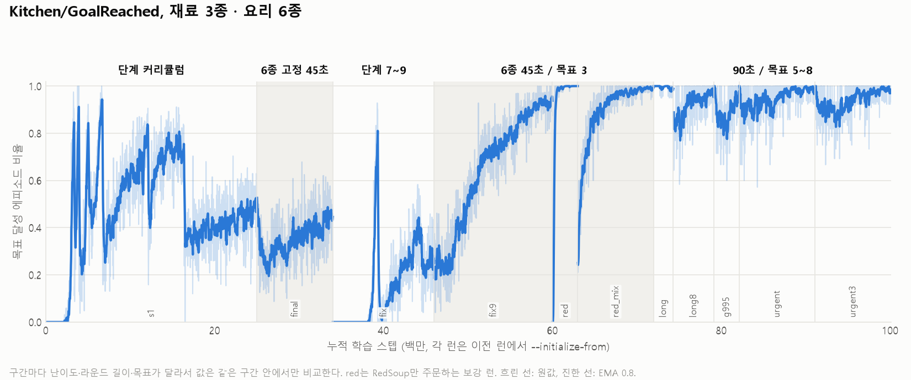

# 재료 2종 → 3종, 요리 3종 → 6종 (2026-10-03 ~ 10-04)

## 요약

출발점은 **재료 2종(초록·빨강), 요리 3종** 모델이다(`undercooked_final3`, 최종 난이도 98%, 관측 103).
여기에 파랑 재료를 넣어 **재료 3종, 요리 6종**으로 늘렸다.

| 모델 | 평가 조건 | 목표 달성 | 잘못 채움 | RedSoup 선택 |
|---|---|---|---|---|
| final3 (재료 2종, 요리 3종) | 45초 / 목표 3 | 97.5% (추론, 1100판) | – | – |
| `undercooked_blue_fix9` (오전) | 45초 / 목표 3 | 92.4% | 9% | 1.5% |
| `undercooked_blue_red_mix` | 45초 / 목표 3 | 99.4% | 3% | 6.5% |
| `undercooked_blue_urgent` | 45초 / 목표 3 | 99.7% | 3% | 10.8% |
| `undercooked_blue_urgent` | 90초 / 목표 8 | 99.1% | 4% | 13.8% |
| **`undercooked_blue_urgent3`** (최종) | 45초 / 목표 3 | **99.5%** | 4% | **16.6%** |
| **`undercooked_blue_urgent3`** (최종) | 90초 / 목표 8 | **99.1%** | 5% | **21.1%** |

"RedSoup 선택"은 냄비에 첫 재료를 넣는 순간 주문판에 RedSoup이 있었던 경우 중 실제로 RedSoup을 만든 비율이다(§5).
목표 달성은 각 진단 추론의 600k 스텝까지 `Kitchen/GoalReached` 요약 평균이다(2026-10-08에 기준을 이것 하나로 통일했다. 그 전 표는 런마다 구간이 달라 0.1\~0.2%p씩 어긋났다).
진단 추론은 모두 `mlagents-learn --inference --initialize-from=<런>`이다. Python 쪽 정책(체크포인트)이 Unity 환경을 움직이며, 내보낸 `.onnx`를 Behavior Parameters에 넣어 Unity 안에서 돌린 평가가 아니다.
**최종 6종 모델은 `archive/runs/undercooked_blue_urgent3/Chef.onnx`** (관측 145). 제출 모델 `models/undercooked.onnx`도 이 모델로 바꿨다.
판 단위로 다시 세면 45초 / 목표 3에서 **1105판 중 99.5%**다. 재료 2종 모델을 같은 방식으로 센 값은 1100판 97.5%다(§5-1).

크게 두 문제를 풀었다.

1. **새 재료를 안 배운다** (오전, §3). 주문 슬롯이 3개라서 이미 익힌 요리 두세 개만 만들어도 성공률이 45\~72%까지 나왔다.
   그래서 성공률 관문이 새 재료를 배우게 만들지 못했다. 지름길 요리를 주문에서 빼는 단계(`recipe_pool_start`)로 풀었다.
2. **초록 없는 요리를 버린다** (오후, §4). 6종을 다 할 줄 알면서도 RedSoup·RedBlueSoup 주문의 절반 이상을 만료시켰다.
   - RedSoup만 학습시키는 방법, 라운드 길이 조정, 만료 벌점 강화로는 움직이지 않았다.
   - **서빙 순간에 "가장 급한 주문을 채웠다"를 바로 보상하자** 처음으로 움직였다(RedSoup 선택 6.5% → 10.8%).
   - 보너스를 3.0으로 키우고 학습률 스케줄을 새로 시작하자 16.6%(45초) / 21.1%(90초)까지 올랐다.
     45초 조건에서는 처음 잡은 기준(20%)에 아직 조금 못 미친다.

## 0. 출발점: 재료 2종 모델

- 주방 하나에 셰프 2명(A: 냄비 쪽, B: 그릇·서빙 쪽). 경계 카운터로 주고받는다. 냄비는 하나, 요리는 모두 재료 2개.
- 요리 3종: GreenSoup(초록 2), MixSoup(초록+빨강), RedSoup(빨강 2).
- 최종 난이도: 손질 필요, 조리 5초, 주문 슬롯 3, 주문 25초, 45초 안에 3접시.
- 학습 경로: `undercooked_v1` → `lesson0` → `v2`(8M 커리큘럼) → `final` → `final2` → `final3`(잘못된 재료 벌점 −0.3). 최종 98%.
- 당시 제출 모델(지금은 `archive/runs/undercooked_final3/Chef.onnx`)은 관측 103차원이다. 이 확장 이후 코드(관측 145)에서는 돌지 않는다.

## 1. 무엇을 바꿨나

| 커밋 | 내용 |
|---|---|
| 31b4d8e (PR #38) | 초록/빨강 하드코딩을 `IngredientType`과 재료별 개수 배열로 일반화. **동작·관측 변화 없음**: final3 모델, 같은 시드 추론 30만 스텝을 전후로 돌려 TensorBoard 지표 435개 값이 전부 같았다 |
| 95cff34 | 파랑 재료함(경계 행 가운데 벽 자리, 레이아웃 `U`), 요리 BlueSoup / GreenBlueSoup / RedBlueSoup. 관측 103 → 145 (one-hot 크기만 늘었다). 단계표에서 예전 5단계(레시피 3, 슬롯 1)를 빼고 파랑 단계 두 개를 덧붙였다 |
| 2a958a0 | `recipe_pool_start`: 주문을 `[start, pool)` 범위에서 뽑는다 (기본 0 = 예전과 같은 난수 호출). 파랑 단계를 7 = BlueSoup만, 8 = 2\~5번(지름길 2종 제외), 9 = 6종으로 바꿨다. 레시피별 냄비 확정 통계 `Kitchen/Made/<요리>` |
| fc2fa79 | yaml `episode_duration`(라운드 길이, 씬 기본 45초는 그대로), `order_expired_penalty`(만료 벌점) |
| 7cbfd77 | yaml `urgent_serve_bonus`: 서빙한 주문이 주문판 전체에서 가장 급했으면(남은 시간 최소) 팀 보너스. 통계 `Kitchen/UrgentServes`. 회귀 검사 [17] |
| 619d49b, e5cdffe, 25930d7 | 오후 런 설정 (`undercooked_blue_long8`, `_long8_g995`, `_urgent3`) |

새 yaml 파라미터 3개는 모두 기본값이면 꺼져 있다. 기존 설정은 동작이 그대로다.
회귀 검사는 17개다 ([15] 레시피 표·파랑 재료, [16] 파랑 단계의 주문 범위, [17] 급한 주문 보너스). 모두 통과.

요리를 늘리면서 지킨 것: **어떤 요리든 재료는 정확히 2개**다. 재료 3종 × 2개 조합 6가지가 전부 요리라서
냄비가 차면 반드시 어떤 요리가 된다. 작업량은 그대로이고 "어느 재료함에서 가져오는가"만 달라진다.

## 2. 런

### 2-1. 오전: 파랑 배우기 (45초 / 목표 3)

| 런 | 출발점 | 스텝 | 시간 | 결과 |
|---|---|---|---|---|
| `undercooked_blue_s1` | 무작위 초기화, 단계 0부터 | 25M | 5h50m | 0\~6단계는 예전 최고 런(stage_s2)과 같은 속도. 7·8단계 강제 승급. 6종 단계 **41%** (16.4\~25M 평균, 마지막 0.5M 50%) |
| `undercooked_blue_final` | blue_s1, 6종 고정 | 9M | 2h03m | 22%까지 떨어졌다가 45%로 돌아옴. **오르지 않음** |
| `undercooked_blue_fix` | blue_final, 새 단계표 7단계부터 | 12M | 2h34m | 파랑을 배움. 7→8, 8→9 모두 강제 승급 (0.714, 0.370). 6종 26% |
| `undercooked_blue_fix9` | blue_fix, 9단계 고정 | 14M | 2h57m | **26% → 93%** |

`undercooked_blue_s1` 단계 승급 (예전 단계표 기준, `archive/runs/undercooked_blue_s1/stage_log.txt`):

| 승급 | 스텝 | 방식 | (stage_s2) |
|---|---|---|---|
| 0 → 1 | 3.38M | 성공률 0.80 | 3.32M |
| 1 → 2 | 3.94M | 성공률 0.80 | 3.96M |
| 2 → 3 | 5.08M | 성공률 0.80 | 5.04M |
| 3 → 4 | 6.44M | 성공률 0.80 | 6.16M |
| 4 → 5 (레시피 3, 슬롯 2) | 6.74M | 성공률 0.93 | – |
| 5 → 6 (기존 최종 난이도) | 11.44M | ★ 강제 (0.716) | – |
| 6 → 7 (앞에서 4종 = 파랑 등장) | 12.14M | 성공률 0.80 | – |
| 7 → 8 (6종) | 16.40M | ★ 강제 (0.718) | – |

0단계는 시드 1로 통과했다 (예전 단계 런은 4개 중 2개가 0단계에서 실패).

### 2-2. 오후: RedSoup 보강

학습 중 지표는 마지막 0.5M 평균이다. "RedSoup 비율"은 만든 요리 중 RedSoup의 비율이다(6종이 고르면 17%).

| 런 | 출발점 | 조건 | 스텝 | 시간 | 목표 달성 | 만료/판 | RedSoup 비율 |
|---|---|---|---|---|---|---|---|
| `undercooked_blue_red` | fix9 | RedSoup만 주문, 45초 | 3M | 38m | 100% | 0.01 | 100% |
| `undercooked_blue_red_mix` | blue_red | 6종, 45초 / 목표 3 | 9M | 1h55m | 99.1% | 0.62 | 3.6% |
| `undercooked_blue_long` | red_mix | 90초 / 주문 45초 / 목표 5 / 만료 −1 | 2.3M (중단) | 30m | 98.5% | 0.35 | 4.6% |
| `undercooked_blue_long8` | blue_long | 90초 / 주문 30초 / 목표 8 / 만료 −1 | 4.8M (중단) | 60m | 97.4% | 2.63 | 7.0% |
| `undercooked_blue_long8_g995` | long8 | 위 + 만료 −3, gamma 0.995 | 3.0M (중단) | 37m | 95.5% | 2.77 | 6.5% |
| `undercooked_blue_urgent` | long8_g995 | 위 + 급한 주문 보너스 1.5 | 9M | 1h53m | 98.9% | 2.51 | 7.9% |
| `undercooked_blue_urgent3` | urgent | 위, 보너스 3.0 | 9M | 1h56m | 98.6% | 2.38 | 12.1% |

오전 60M(약 13시간 30분), 오후 40M(약 8시간 25분). 진단 추론(각 600k, 약 10분)은 따로 9회.

## 3. 진단: 냄비 채움 기록 (오전)

성공률과 잘못 채움 횟수만으로는 "무엇을 만드는가"가 보이지 않았다. 추론 중에 냄비가 찰 때마다 한 줄씩
(첫 재료, 두 번째 재료, 누가 가져왔나, 그 순간의 주문판, 만들어진 요리, 주문에 있었나) 기록했다
(`archive/tools/inference/pot_fill_log.cs`, 요약 `archive/tools/analyze_pot_fills.py`). 세 번 모두 6종 최종 난이도, 600k 스텝.

| | blue_final | blue_fix | **blue_fix9** |
|---|---|---|---|
| 목표 달성 | 45% (학습 지표) | 26.1% | **92.4%** |
| 냄비 채움 / 잘못 채움 비율 | 2148 / 35% | 2760 / 53% | 3386 / **9%** |
| 첫 재료 초록 / 빨강 / 파랑 | 1628 / 520 / **0** | 1072 / **19** / 1669 | 2063 / 487 / 836 |
| 맞게 만든 GreenSoup | 799 | 326 | 912 |
| MixSoup (초록+빨강) | 604 | 22 | 765 |
| RedSoup (빨강 2) | 0 | 0 | 25 |
| BlueSoup | 0 | 384 | 450 |
| GreenBlueSoup | 1 | 544 | 733 |
| RedBlueSoup | 0 | 9 | 195 |

같은 기간 주문에 나온 비율은 재료 기준으로 초록 26\~31%, 빨강 34\~39%, 파랑 31\~36%로 고르다.

### 3-1. blue_final: GreenSoup과 MixSoup만 만든다

- 파랑을 첫 재료로 넣은 적이 없고, 파랑이 들어간 냄비는 600k 동안 1개(GreenBlueSoup)뿐이었다. RedSoup은 0회.
- 슬롯이 3개라 GreenSoup이나 MixSoup이 주문판에 하나라도 있을 확률이 높다. 그 두 요리만 계속 만들면 45%가 나온다.
  파랑 단계(앞에서 4종)도 이 방식으로 72%까지 가서 강제 승급됐다. **성공률 관문이 지름길에 속았다.**
- 잘못 채움의 72%는 두 번째 재료 실수다 (대부분 "파랑이 필요한데 빨강/초록을 넣음").
- 재료의 87%는 셰프 B가 카운터로 넘긴다. 레시피는 사실상 B가 정한다.

### 3-2. blue_fix: 파랑을 배우고 빨강을 버린다

- 7단계(BlueSoup만)에서 2M 동안 아무것도 못 만들다가, 엔트로피가 0.87 → 1.2로 오르면서
  파랑을 집기 → 손질 → 전달 → 냄비 투입 순으로 배웠다 (4M에 BlueSoup 판당 1.1회).
- 7단계 마지막 500판은 71%로, 파랑 요리 자체는 할 줄 안다. 강제 승급은 초반 무성공 구간이 6000판 중 상당수를 쓴 탓이다.
- 그런데 6종에서는 초록·파랑만 쓰고 빨강을 버렸다 (첫 재료 빨강 19회). **재료 3종 중 2종만 쓰는 패턴이 반복됐다.**

### 3-3. blue_fix9: 세 재료를 다 쓴다

- 6종을 섞어 이어 학습하자 세 재료를 다 쓰게 됐다 (26.7% → 47% (4M) → 71% (7M) → 86% (10M) → 93% (14M)).
- 같은 "6종 고정 이어 학습"이 blue_final(파랑을 전혀 모르는 정책)에서는 효과가 없었다.
  **섞어서 다듬는 단계는 각 재료를 한 번씩 배운 뒤에야 효과가 있다**고 본다 (런 하나씩이라 확정은 아니다).
- 남은 실패 306회 중 82%는 두 번째 재료 실수이고, 가장 많은 것은 "파랑 다음에 빨강이 필요한데 파랑을 넣음"(74회)이다.

## 4. RedSoup 보강 (오후)

fix9는 92.4%였지만 RedSoup 주문 1708번 중 25번만 만들었다. 나머지 5종으로 메워서 나온 성공률이다.

### 4-1. RedSoup만 학습 → 6종 다시 섞기: 성공률은 올랐지만 RedSoup은 다시 줄었다

- `undercooked_blue_red`(RedSoup만 주문)는 1.3M에 99%, 3M에 100%였다. RedSoup 자체는 할 줄 안다.
- 6종으로 다시 섞은 `undercooked_blue_red_mix`는 성공률을 빠르게 회복해 fix9보다 높아졌다(2M에 85%, 9M에 99%).
  그런데 RedSoup은 판당 0.47(첫 0.5M) → 0.11(마지막 0.5M)로 다시 줄었다.
- 진단(45초 조건): 목표 달성 99.4%, 잘못 채움 3%, RedSoup 선택 116/1774 = **6.5%**.
- "재료함이 빨강만 열려 있어서 생긴 습관(주문을 안 읽고 빨강 2개)"이라는 가설은 틀렸다. 주문에 없는 RedSoup은 2번뿐이었다.
  정책은 빨강을 전반적으로 피한다.

### 4-2. 왜 버리나: 버리는 주문의 대가가 없다

- 목표 접시를 채우면 판이 바로 끝나서 모든 주문을 처리할 필요가 없고, 어느 요리든 보상이 같다(서빙 +3.0, 만료 −0.5).
  그러면 **어느 주문을 버릴지가 공짜 선택이 된다.** 정책은 초록으로 시작하는 습관을 굳혔다.
  (처음에는 "매 판 일부 주문은 만료될 수밖에 없다"고 적었는데 틀렸다. 최종 모델 45초 평가에서 1105판 중 775판은 만료 0건이었다.)
  초록으로 시작하면 G2/GR/GB 셋 중 하나가 되는데, 주문 3칸이 독립·균등하게 뽑힌다면 셋 중 하나가 있을 확률은 87.5%다.
  플레이 중에는 처리한 주문만 새로 뽑히므로 분포가 달라진다. urgent3 45초 진단에서 첫 재료 순간 초록 요리가 있었던 비율은 82%였다.
- 처음에는 처리 속도를 "15초에 1접시"로 잘못 계산했다. 실제는 **약 9초에 1접시**다.
  라운드는 목표를 채우면 바로 끝나는데(red_mix: 3접시 약 26초), 그 때문에 느려 보였던 것이다.
  - 그래서 진짜 이유는 이것이었다: **라운드가 주문 수명 무렵에 끝나서 버린 주문이 만료되기 전에 라운드가 끝난다.**
  - 예: 26초 라운드에 주문 25초, `undercooked_blue_long`은 46초 라운드에 주문 45초.

### 4-3. 라운드를 늘려 만료가 라운드 안에서 일어나게: 만료는 늘었지만 RedSoup은 그대로

- `undercooked_blue_long8`: 90초 / 주문 30초 / 목표 8(약 70초) / 만료 −1.
  판이 72초로 길어지고 만료가 판당 약 3건 붙었다. 그런데 RedSoup 비율은 4\~7%에서 움직이지 않았다.
- `undercooked_blue_long8_g995`: 만료 −3, gamma 0.995. 그래도 4\~6%.
- 학습 중 주문판을 3분 관찰했다(`archive/tools/inference/order_outcome_log.cs`, 결과 `archive/runs/undercooked_blue_long8_g995/order_outcomes.txt`).

  | 요리 | G2 | GR | GB | B2 | **R2** | **RB** |
  |---|---|---|---|---|---|---|
  | 만료 비율 | 0% | 5% | 7% | 23% | **49%** | **51%** |

  만료의 91%가 초록 없는 요리였다. 정책은 판당 약 −8.7의 벌점을 받으면서도 습관을 바꾸지 않았다.
- 해석: 만료는 무엇을 만들지 고른 뒤 10\~30초(100\~300 decision) 늦게 온다. gamma 0.99에서는 그 시점에 0.05\~0.37로, 이 런의 gamma 0.995에서도 0.22\~0.61로 깎인다.
  늦게 오는 벌점이 이미 굳은 습관을 바꾸지 못한 원인이라고 본다. 런 하나씩의 관찰이고, 이 설명을 따로 검증하지는 않았다.

### 4-4. 서빙 순간의 보너스: 처음으로 움직였다

- `urgent_serve_bonus`: 서빙한 주문이 그 순간 주문판에서 가장 급한 주문이면 팀 보너스를 준다.
  순위만 보므로 주문판이 그대로인 동안에는 기다려도 순위가 바뀌지 않는다.
  다만 만료된 칸은 바로 새 주문(시간 가득)으로 채워지므로, 더 급한 주문이 만료되기를 기다리면 들고 있는 요리가 "가장 급한" 주문이 될 수 있다.
  정책이 이 경로를 쓴다는 증거는 없지만, 기다림으로 보너스를 얻을 수 없다는 보장도 없다.
- `undercooked_blue_urgent`(보너스 1.5): 학습 중 RedSoup 비율이 5.7%에서 2.5M까지 한 번도 꺾이지 않고 7.9%로 올랐다.
  5M 이후 8\~10%에서 정체했다. RedBlueSoup은 판당 0.56 → 0.86, 만료는 2.97 → 2.51(첫 0.5M → 마지막 0.5M).

### 4-5. 보너스 3.0: RedSoup 선택이 기준을 넘었다 (90초 조건)

`undercooked_blue_urgent3`: 보너스를 서빙 보상과 같은 3.0으로 올리고 학습률 스케줄을 새로 시작했다.
urgent의 막바지 정체에는 linear 학습률이 이미 작아진 영향도 섞여 있다고 봤다.

- 처음 2.5M은 흔들렸다. 학습률이 다시 커지고 엔트로피가 0.68 → 0.78로 오르면서 목표 달성이 93% → 87%로 내려갔다.
- 그 뒤 회복해 마지막 0.5M 평균 98.6%가 됐다. RedSoup 비율은 7.6%(2.0\~2.5M) → 10.0%(4.5\~5.0M) → 12.1%(8.5\~9.0M)로 올랐다.
- 진단: RedSoup 선택 16.6%(45초) / 21.1%(90초). urgent의 10.8% / 13.8%에서 크게 올랐다.
- 대가: RedBlueSoup이 14.9% → 12.6%(45초), MixSoup이 53.9% → 47.4%로 조금 내려갔고 잘못 채움이 1%p 늘었다.
  초록 없는 빨강 요리 둘(R2 + RB)을 합치면 12.8% → 14.6%(45초), 16.1% → 18.2%(90초)로 순증이다.
- 목표 달성은 거의 같다(99.5% / 99.1%, urgent는 99.7% / 99.1%). 그래서 **urgent3를 최종 6종 모델로 정했다.**
- 이 향상이 보너스 크기 때문인지, 학습률 재시작이나 추가 학습 때문인지는 나누지 않았다(§7).

## 5. 요리별 선택 비율 (진단, 600k 추론)

그 요리가 냄비 첫 재료 순간 주문판에 있었던 횟수 중, 그 주문을 실제로 맞게 만든 비율이다. 두 재료 사이에 새로 들어온 주문과 맞은 냄비는 분자에서 뺀다(2026-10-08 정정. 그 전에는 분자에 넣어서 분자가 분모 사건의 부분집합이 아니었고, `eval_blue_final`의 GreenSoup이 108%로 나왔다. 아래 표에서 바뀐 값은 0.1\~0.3%p다).
주문판에 여러 요리가 있으면 하나만 고를 수 있으므로 모두 100%가 될 수는 없다.

| 모델 / 조건 | G2 | GR | GB | B2 | **R2** | **RB** |
|---|---|---|---|---|---|---|
| fix9 / 45초 | 95.3% | 60.8% | 53.8% | 31.3% | **1.5%** | 11.5% |
| red_mix / 45초 | 96.9% | 59.3% | 56.0% | 35.2% | **6.5%** | 11.2% |
| urgent / 45초 (보너스 꺼짐) | 93.0% | 53.9% | 49.6% | 33.8% | **10.8%** | 14.9% |
| urgent / 90초 (학습 조건) | 86.6% | 60.7% | 56.3% | 27.5% | **13.8%** | 18.6% |
| **urgent3 / 45초** (보너스 꺼짐) | 90.1% | 47.4% | 50.2% | 36.1% | **16.6%** | 12.6% |
| **urgent3 / 90초** (학습 조건) | 81.8% | 49.7% | 51.4% | 32.3% | **21.1%** | 15.5% |

기록: `archive/runs/eval_undercooked_blue_{fix9,red_mix,urgent_45,urgent_90,urgent3_45,urgent3_90}/summary.txt`.
진단 설정은 `configs/undercooked_blue_eval45.yaml`, `_eval90.yaml`이다.

### 5-1. 판 단위 재집계 (최종 모델)

재료 2종 모델을 잰 방식 그대로 urgent3의 판을 하나씩 셌다.
`configs/undercooked_blue_eval45.yaml`, `--inference --seed=1`, 600k 스텝. Play 직후 `archive/tools/inference/episode_log_public.cs`를 붙이고 `archive/tools/analyze_episodes.py`로 요약했다.

| 모델 | 판 | 목표 달성 | 잘못 채움이 있었던 판 | 그 판의 목표 달성 | 성공한 판 길이 (중앙값) |
|---|---|---|---|---|---|
| final3 (재료 2종, `eval_final3`) | 1100 | 97.5% ±0.9 | 16.7% | 88.6% | 25.2초 |
| **urgent3 (재료 3종)** | **1105** | **99.5% ±0.4** | 11.0% | 96.7% | 23.9초 |

- 실패 6판: 2접시 5판, 0접시 1판. 모두 45초를 다 쓰고 끝났고 주문 3개가 만료됐다. 0접시 판은 틀린 요리를 한 번 서빙했다.
- 재료 2종 모델은 잘못 채움이 2\~3번 겹친 판(40판)에서 무너졌다(목표 달성 65%). urgent3는 2번 겹친 판이 12판이고 모두 성공했다.
- 예전 문서의 "97.1%, 478판"은 같은 모델을 더 짧게 잰 값이다. 같은 600k 스텝 기준으로는 97.5%다.
- `episode_log.cs`는 리플렉션으로 비공개 필드를 읽는데, unity-mcp의 `Unity_RunCommand`가 리플렉션을 막는다.
  그래서 공개 API(`LastEpisodeChain`, `OrderMissThisEpisode`, `WrongDishSeconds`)만 쓰는 버전을 만들었다.
  만료 주문 수는 주문판에서 남은 시간이 0.6초 미만이던 칸이 새로 채워진 횟수로 센다.

기록: `archive/runs/eval_undercooked_blue_urgent3_episodes/` (`episodes.txt`, `summary.txt`).

### 5-2. 학습 곡선

런 11개를 이어 붙였다(약 100M 스텝). 구간마다 난이도·라운드 길이·목표가 달라서 값은 같은 구간 안에서만 비교한다.
그림 스크립트는 `archive/tools/figures/plot_blue.py`.

## 6. 배운 것

1. **성공률 관문은 지름길에 속는다.** 슬롯이 여러 개면 이미 아는 요리로 성공률을 채운다.
   새 요리를 가르칠 때는 지름길 요리를 주문에서 빼야 한다(`recipe_pool_start`).
2. **한 요리만 따로 가르쳐도 섞으면 다시 잊는다.** RedSoup만 학습(100%) → 6종 섞기 → RedSoup 3.6%.
   할 줄 아는 것과 고르는 것은 다른 문제였다.
3. **"무엇을 버릴지"가 공짜면 편향이 생긴다.** 보상이 요리와 무관하고 일부 주문을 반드시 버려야 하면, 정책은 가장 편한 습관을 고른다.
4. **이번 런들에서는 늦게 오는 벌점이 굳은 습관을 바꾸지 못했다.** 만료 벌점을 −0.5 → −3으로, gamma를 0.995로 올려도 그대로였다.
   결정 순간에 가까운 보상(서빙 시점 보너스)을 넣은 뒤에야 움직였다.
   보너스를 키우고 학습률을 다시 시작하자 한 단계 더 움직였다(10.8% → 16.6%).
   런 하나씩이고 보너스·추가 학습·학습률 재시작을 나눈 대조가 없어서, 일반 법칙이 아니라 이 사슬에서 본 것이다.
5. **지표를 먼저 의심한다.** 처리 속도 오판(15초 vs 9초)은 "라운드가 목표 달성 시 끝난다"는 것을 놓친 탓이었다.
   판 길이(`Environment/Episode Length`)를 같이 봤으면 바로 보였다.
6. **진단 도구가 결정을 바꿨다.** 냄비 채움 기록과 주문 결과 관찰이 없었으면 "성공률은 높으니 됐다"로 끝났을 것이다.

## 7. 한계

- 최종 모델은 런 여러 개를 이어 붙인 것이다. 고친 단계표로 무작위 초기화부터 한 번에 되는지는 확인하지 않았다.
- 모두 시드 1, 런 하나씩이다.
- 지름길 단계(7·8)는 둘 다 강제 승급으로 끝났다. 6000판 상한이 없었다면 더 오래 걸렸다.
- 관측이 145차원이라 재료 2종 모델(103차원)과 바꿔 끼울 수 없다. 제출 모델은 urgent3로 바꿨고, 재료 2종 모델은 이 코드에서 돌지 않는다.
- 초록 없는 요리 편향은 줄었지만 남아 있다. 초록 있는 요리는 47\~90%로 고르고, 초록 없는 요리는 13\~36%로 고른다.
  RedSoup을 늘리는 대신 RedBlueSoup·MixSoup이 조금 줄었다.
- urgent 계열은 90초 / 목표 8 조건으로 학습했다. 45초 조건 평가에서도 99.5%였지만, 그 조건으로 이어 학습한 모델과 비교하지는 않았다.
- urgent3의 개선이 보너스 크기 때문인지, 학습률 재시작 때문인지는 나누지 않았다(보너스 1.5로 학습률만 재시작한 대조가 없다).

## 8. 다음

1. **관측 방식 변경 (재료 구성 인코딩)**: 주문과 냄비 내용물을 같은 "재료 구성" 형식으로 준다.
   지금은 요리 one-hot이라 "RedSoup = 빨강 2개"를 정책이 따로 외워야 한다. 처음부터 학습이 필요하다.
2. **처음부터 한 번에**: 고친 단계표 + `urgent_serve_bonus`를 처음부터 켠 채 무작위 초기화로 학습해, 편향이 처음부터 덜 생기는지 본다.
3. **처리량에 맞춘 주문**: 슬롯 수나 주문 간격을 처리 속도에 맞춰, 주문을 버릴 수밖에 없는 상황 자체를 줄인다.
